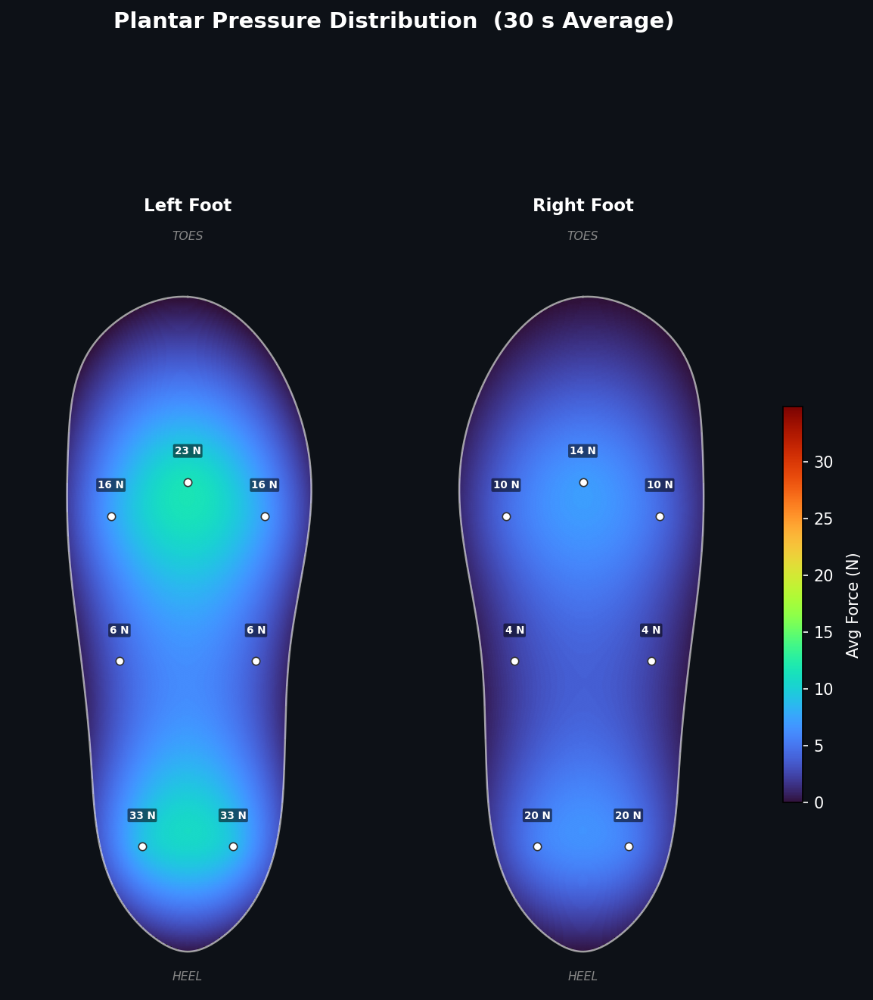
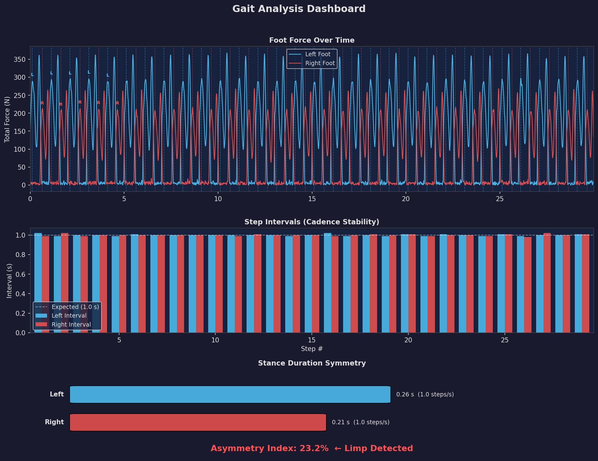

# GrandHack26 — Smart Shoe Pressure Sensor Demo

A proof-of-concept for post-surgical rehabilitation monitoring using embedded shoe pressure sensors. Simulates a patient with a right-foot limp and produces clinical-quality visualizations from 14-channel plantar pressure data.

---

## Overview

After surgery, quantifying how much load a patient puts on the recovering foot is critical — but difficult to observe clinically. This system uses 7 force sensors per shoe (14 total) to:

- Map real-time plantar pressure across the entire foot
- Detect gait asymmetry and limp automatically
- Track cadence and stance-phase timing over time

This demo uses **synthetically generated data** (realistic gait physics with an injected limp) to demonstrate what a live hardware deployment would produce.

---

## Sensor Layout

Each shoe contains 7 pressure sensors:

```
  [toe_L]  [toe_C]  [toe_R]      ← 3 metatarsal-head sensors
     [mid_L]     [mid_R]         ← 2 arch/midsole sensors
     [heel_L]    [heel_R]        ← 2 heel sensors
```

Forces are recorded in **Newtons** at **100 Hz**. At peak stance, a ~70 kg person produces ≈700 N total across both feet.

---

## Outputs

### 1. Plantar Pressure Heat Map



- **Left foot** — normal loading pattern
- **Right foot** — reduced loading (limp simulation, 72% of normal)
- RBF interpolation between sensor points for smooth pressure gradients
- Anatomically correct foot silhouette with sensor markers and force labels in Newtons

### 2. Gait Analysis Dashboard



- **Force traces** — total foot force over 30 seconds with heel-strike markers
- **Step intervals** — cadence stability bar chart vs. expected 1.0 s/step
- **Symmetry summary** — stance duration comparison with asymmetry index; flags "Limp Detected" when asymmetry > 15%

---

## Gait Simulation Details

| Parameter | Left Foot (Normal) | Right Foot (Limp) |
|---|---|---|
| Load factor | 100% | 72% |
| Stance duration | 60% of cycle | 50% of cycle |
| Heel-strike delay | — | +0.04 s |
| Cadence | 1.0 steps/s | 1.0 steps/s |

Pressure distribution per anatomical zone (normal foot):
- **Heel** — ~40% body weight (initial contact through midstance)
- **Arch/midsole** — ~9% body weight (arch rarely contacts ground)
- **Metatarsal heads** — ~51% body weight (push-off spike)

---

## Project Structure

```
GrandHack26/
├── generate_data.py      # Synthetic gait CSV generation
├── heatmap_viz.py        # Plantar pressure heat map
├── gait_viz.py           # Gait timeline + metrics dashboard
├── run_demo.py           # Entry point — runs everything
├── requirements.txt
└── data/
    ├── gait_data.csv     # Auto-generated (created on first run)
    ├── heatmap.png
    └── gait_analysis.png
```

---

## Quickstart

```bash
pip install -r requirements.txt
python run_demo.py
```

On first run, `generate_data.py` creates a 30-second synthetic gait recording (~3,000 rows at 100 Hz). Both visualizations are then rendered and saved to `data/`.

---

## Requirements

```
numpy>=1.24
pandas>=2.0
matplotlib>=3.7
scipy>=1.10
```

---

## Clinical Motivation

Post-surgical patients often unconsciously offload a recovering limb — a compensatory pattern that, if left uncorrected, can lead to secondary injuries and slowed healing. Traditional observation is subjective and infrequent. Continuous sensor-based monitoring enables:

- Objective, timestamped load history
- Early detection of protective limping
- Progress tracking across rehabilitation sessions
- Remote monitoring via mobile app integration (planned)

---

*Built for MIT GrandHack26*
